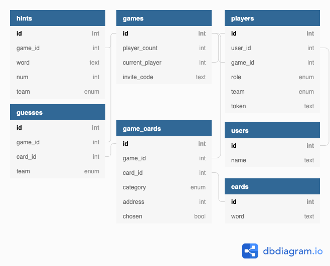

# Codewords Server [](https://travis-ci.com/code-words/codewords-server)

This is the server side of the Codewords game. It manages game state and handles turn logic, however it does not have a built-in front-end. You will also need the Codewords UI available within this organization.

### Requirements

- Ruby 2.6.3
- Rails 5.2.3
- This server

### Setup

01. Clone this repository and run `bundle install`.
02. Prepare database with `rails db:create`
03. Migrate with `rails db:migrate`
04. Start the server with `rails s`


### Schema

[](https://dbdiagram.io/d/5d28ffa3ced98361d6dc9ccb)

## API Endpoints

- [Create/Initiate Game](#create-game)
- [Join Existing Game](#join-game)

---

### Create Game

Request that the server create a new Game instance and attach the requesting user as a Player. Because we are not managing persistent users at this time, this endpoint also creates a User record for the requesting user.

##### Request
```http
POST /api/v1/games
```
```js
{
  "name": "Archer"
}
```
|key|description|
|:---:|:--- |
|`name`|The username that the requesting user would like to use during the game|

##### Successful Response
```http
HTTP/1.1 201 Created
```
```js
{
  "game_channel": "game_9aZReVkGAotVahGLS88vEnYw",
  "invite_code": "L6J5suAqTsKUAjEXm5swoEUN",
  "name": "Archer",
  "token": "uuxHQc7djqQuzWgJxAp5r1vy"
}
```
|key|description|
|:---:|:--- |
|`game_channel`|The Websockets channel that players will connect to for game-wide data updates.|
|`invite_code`|A code which can be shared with other players. They will use this code to join the game.|
|`name`|A confirmation that the requested name was indeed assigned to the player.|
|`token`|A token unique to the current player, which can be used to identify them in future requests to the server.|

<details><summary>Failed Responses</summary>

##### Name Omitted
This error occurs if the body of the request does not contain a `name`, or if the `name` is empty.
```http
HTTP/1.1 401 Unauthorized
```
```js
{
  "error": "You must provide a username"
}
```

</details>

---

### Join Game

Request that the server create a new Player instance for the requesting user and attach it to the Game denoted by the invite code.

##### Request
```http
POST /api/v1/games/:invite_code/players
```
```js
{
  "name": "Lana"
}
```
|key|description|
|:---:|:--- |
|`:invite_code`| (Within URI) The invite code provided by the person inviting the requesting user to their existing game.|
|`name`|The username that the requesting user would like to use during the game|

##### Successful Response
```http
HTTP/1.1 200 OK
```
```js
{
  "game_channel": "game_9aZReVkGAotVahGLS88vEnYw",
  "name": "Lana",
  "token": "uuxHQc7djqQuzWgJxAp5r1vy"
}
```
|key|description|
|:---:|:--- |
|`game_channel`|The Websockets channel that players will connect to for game-wide data updates.|
|`name`|A confirmation that the requested name was indeed assigned to the player.|
|`token`|A token unique to the current player, which can be used to identify them in future requests to the server.|

<details><summary>Failed Responses</summary>

##### Name Omitted
This error occurs if the body of the request does not contain a `name`, or if the `name` is empty.
```http
HTTP/1.1 401 Unauthorized
```
```js
{
  "error": "You must provide a username"
}
```

##### Name Already In Use
This error occurs if the `name` requested by the user is already in use by another Player in this game.
```http
HTTP/1.1 401 Unauthorized
```
```js
{
  "error": "That username is already taken"
}
```

##### Invalid Invite Code
This error occurs if the invite code provided by the user does not match a current game.
```http
HTTP/1.1 401 Unauthorized
```
```js
{
  "error": "That invite code is invalid"
}
```

##### Game Is Full
This error occurs if the invite code provided for the user matches a game that does not have room for additional players.
```http
HTTP/1.1 401 Unauthorized
```
```js
{
  "error": "That game is already full"
}
```

</details>
